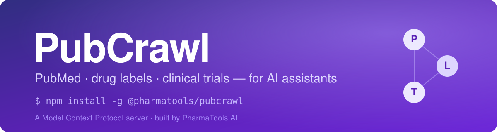

<div align="center">



<h1></h1>

**An [MCP server](https://modelcontextprotocol.io) that gives AI assistants access to PubMed, Europe PMC, FDA & UK drug labelling, and ClinicalTrials.gov.**

_A peer-reviewed pub crawl through the literature — the label — and the trial._

[](https://github.com/nickjlamb/pubcrawl/actions/workflows/build.yml)
[](https://www.npmjs.com/package/@pharmatools/pubcrawl)
[](https://www.npmjs.com/package/@pharmatools/pubcrawl)
[](https://nodejs.org)
[](https://registry.modelcontextprotocol.io/?q=pubcrawl)
[](LICENSE)
[](CONTRIBUTING.md)

[Quick start](#-quick-start-60-seconds) · [Tools](#-tools) · [Examples](#-examples) · [Architecture](#-architecture) · [Roadmap](ROADMAP.md) · [Contributing](CONTRIBUTING.md)

</div>

---

## ✨ What is PubCrawl?

PubCrawl connects your AI assistant (Claude Desktop, Cursor, or any MCP-compatible client) directly to the primary sources clinicians and researchers actually use — so you can ask a question in plain English and get an answer grounded in **PubMed**, **Europe PMC**, **FDA/UK drug labelling**, and **ClinicalTrials.gov**, with real PMIDs, NCT IDs, and DOIs you can verify.

Every tool is a thin, deterministic wrapper over an official API. Nothing is invented; every result cites its source.

- 🔬 **14 tools** across literature, drug labelling, and clinical trials
- 🧾 **Verifiable by design** — results link back to DailyMed, the eMC, PubMed, and ClinicalTrials.gov
- 🌍 **US *and* UK labelling** — a side-by-side `compare_labels` no other MCP server offers
- 📰 **Preprints** via Europe PMC — surface work ahead of formal publication
- 🆓 **No API keys required** (an optional free NCBI key raises PubMed rate limits)
- 🧪 Fully **typed, tested, and CI-checked**

Built by [PharmaTools.AI](https://pharmatools.ai).

---

## 🚀 Quick start (60 seconds)

**1. Add PubCrawl to your client config** — no install step needed, `npx` fetches it on first run.

For **Claude Desktop**, edit `claude_desktop_config.json`:

- **macOS:** `~/Library/Application Support/Claude/claude_desktop_config.json`
- **Windows:** `%APPDATA%\Claude\claude_desktop_config.json`

```json
{
  "mcpServers": {
    "pubcrawl": {
      "command": "npx",
      "args": ["-y", "@pharmatools/pubcrawl"]
    }
  }
}
```

**2. Restart your client.** PubCrawl appears under **+ → Connectors**.

**3. Ask away:**

> _"Compare the US and UK labelling for atorvastatin, and find recent Phase 3 trials for it."_

That's it. → [More examples](#-examples) · [API key & other options](#-configuration)

---

## 🧰 Tools

### 📚 Literature

| Tool | What it does |
|------|-------------|
| `search_pubmed` | Search PubMed with filters for date range, article type, and sort order. Returns PMIDs, titles, authors, journals, and DOIs. |
| `search_europepmc` | Search Europe PMC — a broader corpus than PubMed that also indexes preprints (bioRxiv, medRxiv) and patents. Each result includes an abstract snippet, citation count, open-access status, and a preprint flag. Filter to preprints or open-access only. |
| `get_abstract` | Get the full structured abstract for an article — broken into labeled sections (background, methods, results, conclusions) with keywords and MeSH terms. |
| `get_full_text` | Retrieve the full text of open-access articles from PubMed Central, with parsed sections, figure/table captions, and reference counts. |
| `find_related` | Find similar articles using PubMed's neighbor algorithm, ranked by relevance score. |
| `format_citation` | Generate a formatted citation in APA, Vancouver, Harvard, or BibTeX style. |
| `trending_papers` | Find recent papers on a topic, with optional filtering to high-impact journals (Nature, Science, Cell, NEJM, Lancet, JAMA, etc.). |

### 💊 Drug labelling

| Tool | What it does |
|------|-------------|
| `resolve_drug_name` | Convert a brand drug name to its generic (or a generic to its US brand names), with drug class and common indications. Deterministic, via RxNorm/openFDA — no AI. |
| `get_uspi` | Pull US Prescribing Information sections via openFDA (cited to DailyMed) — indications, dosing, warnings, contraindications, and more. |
| `get_smpc` | Retrieve UK Summary of Product Characteristics from the eMC — the UK equivalent of US prescribing information, with numbered SmPC sections. |
| `compare_labels` | Side-by-side comparison of US (USPI) and UK (SmPC) labelling for the same drug. Spot regulatory differences in indications, warnings, and dosing. |
| `search_by_indication` | Find drugs approved for a medical condition. Searches FDA labelling via openFDA, then cross-references UK availability on the eMC. |

### 🧫 Clinical trials

| Tool | What it does |
|------|-------------|
| `search_trials` | Search ClinicalTrials.gov for clinical trials. Filter by condition, intervention, recruitment status, and phase. Returns NCT IDs, sponsors, enrollment, and links. |
| `get_trial` | Get full details for a clinical trial by NCT ID — eligibility criteria, study design, arms, primary/secondary outcomes, locations, and associated PubMed IDs. |

---

## 💬 Examples

Once connected, just ask naturally:

**Literature**
- "Search PubMed for recent clinical trials on semaglutide."
- "Search Europe PMC for preprints on GLP-1 receptor agonists, most cited first."
- "Get the abstract for PMID 38127654, then find related papers and cite them all in Vancouver style."
- "What are the trending papers on CRISPR gene therapy this month, high-impact journals only?"
- "Pull the full text of that PMC article and summarise the methods section."

**Drug labelling**
- "Get the FDA prescribing information for metformin — just the indications and warnings."
- "Pull the UK SmPC for atorvastatin."
- "Compare US and UK labelling for lisinopril and highlight the differences."
- "What's the generic name and drug class for Ozempic?"
- "What drugs are approved for type 2 diabetes in both the US and UK?"

**Clinical trials**
- "Find recruiting Phase 3 trials for pembrolizumab in breast cancer."
- "Get the eligibility criteria and primary outcomes for NCT03086486."

**Cross-source (where PubCrawl shines)**
- "For semaglutide: summarise the US label's cardiovascular indication, then find the pivotal trial and its NEJM publication."

---

## 🏗 Architecture

Three layers — **tools** register the MCP interface, **lib clients** talk to each external API, and shared **cache** + **parsers** keep it fast and consistent.

<picture>
  <source media="(prefers-color-scheme: dark)" srcset="docs/architecture-dark.svg">
  
</picture>

Each tool file exports a `register*Tool(server)` function with a zod schema and an async handler. All network calls are rate-limited, cached, and time-bounded. See [`CLAUDE.md`](CLAUDE.md) for a full architecture walkthrough and [`CONTRIBUTING.md`](CONTRIBUTING.md) to add a tool.

---

## 🔧 Configuration

### Install options

```bash
# Zero-install (recommended): npx fetches it on demand — see Quick start above.

# Or install globally:
npm install -g @pharmatools/pubcrawl

# Config for a global install:
#   { "mcpServers": { "pubcrawl": { "command": "pubcrawl" } } }
```

### NCBI API key (optional)

Without a key, PubMed requests are limited to 3/second. A free key raises this to 10/second.

1. Create a free NCBI account at <https://www.ncbi.nlm.nih.gov/account/>
2. Account Settings → API Key Management → create a key
3. Add it to your config:

```json
{
  "mcpServers": {
    "pubcrawl": {
      "command": "npx",
      "args": ["-y", "@pharmatools/pubcrawl"],
      "env": { "NCBI_API_KEY": "your_key_here" }
    }
  }
}
```

### HTTP transport

PubCrawl also ships a stateless Streamable HTTP transport for browser-based and hosted clients:

```bash
npm run start:http   # serves POST /mcp and GET /health on PORT (default 3000)
```

---

## 🗺 Roadmap

Highlights of what's planned — see [`ROADMAP.md`](ROADMAP.md) for the full list.

- `get_europepmc_fulltext` — read preprints & OA articles surfaced by `search_europepmc`
- `get_adverse_events` — openFDA FAERS adverse-event lookups
- EMA / EPAR labelling to complement the US + UK `compare_labels`
- MeSH query helper for sharper PubMed searches
- MCP **resources** & **prompts** for common review workflows

Ideas welcome — [open an issue](https://github.com/nickjlamb/pubcrawl/issues/new/choose).

---

## 🛠 Development

```bash
git clone https://github.com/nickjlamb/pubcrawl.git
cd pubcrawl
npm install

npm run dev      # TypeScript watch mode
npm run build    # compile to dist/
npm start        # run the stdio server
npm test         # Vitest unit suite
npm run lint     # ESLint
```

Unit tests live in `tests/` and cover the parsing, caching, citation, and formatting logic with fixture payloads (no network calls). CI runs lint → test → build on every push and pull request. New to the codebase? Start with [`CONTRIBUTING.md`](CONTRIBUTING.md).

---

## 📦 Releases & changelog

Versions follow [Semantic Versioning](https://semver.org). See the [**CHANGELOG**](CHANGELOG.md) for a full history and [Releases](https://github.com/nickjlamb/pubcrawl/releases) for notes and assets.

## 🤝 Contributing

Contributions are welcome and appreciated — bug reports, new data sources, new tools. Read the [contributing guide](CONTRIBUTING.md) to get started, then [open an issue](https://github.com/nickjlamb/pubcrawl/issues/new/choose) or a pull request.

## 📄 License

[MIT](LICENSE) © [PharmaTools.AI](https://pharmatools.ai)

<div align="center">
<sub>Data from NCBI E-utilities, Europe PMC, openFDA, DailyMed, the UK eMC, and ClinicalTrials.gov. PubCrawl is not affiliated with these providers.</sub>
</div>
